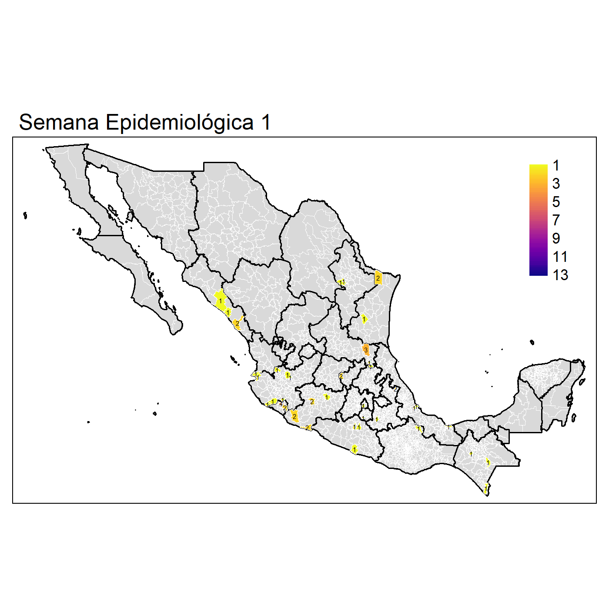
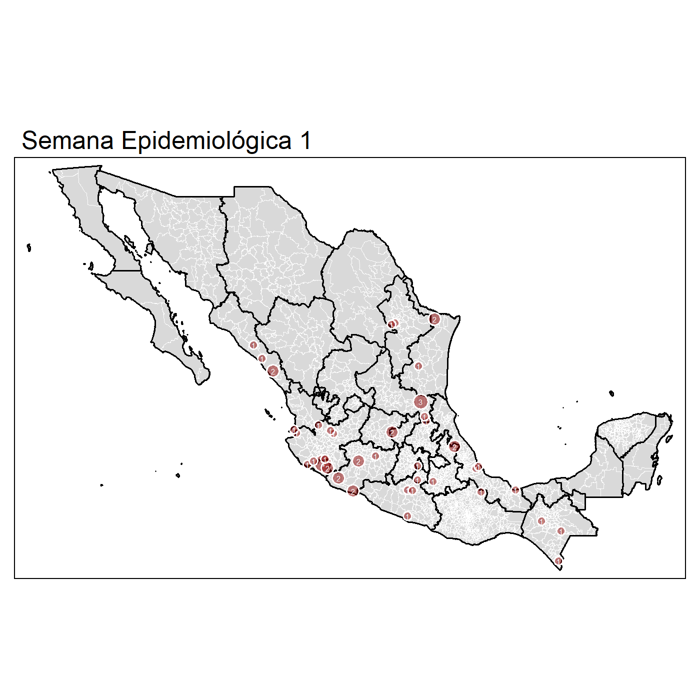

```{r, cache=TRUE}
x <- boldenr::read_dataset_bol(path = "C:/Users/felip/OneDrive/datasets/DGE/arbo/",
                                dataset = "sinave")
source('C:/Users/felip/Dropbox/r_developments/r_dashboards/github_pages/test_dashboard/3.Functions/heatmap_confirmados.R')
```

```{r}
library(formattable)
library(tmap)
library(rmarkdown)
library(knitr)
library(shiny)
library(flexdashboard)
library(plotly)
library(boldenr)
library(magrittr)
library(leaflet)
library(ggplot2)
```


**Vigilancia Epidemiológica**
=====================================  

Column {.tabset}
------------------------------------


### **<span style="color:#7d9029"> Casos por Estado </span>**
<html>
<head>
<style>
</style>
</head>
<body>
<div >
  <h2></h2>
  <p></p>

#### **<span style="color:blue">Rank de los Casos de Dengue por semana </span>**
```{r}
##
rank_cases <- function(x){
    x %>%
        arrange(dplyr::desc(value)) %>%
        dplyr::mutate(rank = 1:dplyr::n())
}
##

df <- x %>%
    dplyr::filter(ANO == 2021) %>%
    dplyr::filter(!DES_EDO_RES %in% c("OTROS PAISES", 
                                      "OTROS PAISES DE LATINOAMERICA",
                                      "ESTADOS UNIDOS DE NORTEAMERICA")) %>%
    dplyr::filter(DES_DIAG_FINAL %in% 
                      c("DENGUE CON SIGNOS DE ALARMA", 
                        "DENGUE NO GRAVE", 
                        "DENGUE GRAVE")) %>%
    dplyr::group_by(DES_EDO_RES, SEM) %>%
    dplyr::summarise(value = dplyr::n(), .groups = "drop") %>%
    dplyr::group_by(SEM) %>%
    dplyr::mutate(CVE_EDO_RES = DES_EDO_RES) %>%
    #dplyr::mutate(rank = rank(value, ties.method = "random"))%>% 
    tidyr::nest() %>%
    dplyr::mutate(rank = purrr::map(data,
                                    rank_cases)) %>%
    dplyr::select(-data) %>%
    tidyr::unnest(cols = c(rank)) %>%
    as.data.frame()


plotly::ggplotly(
    ggplot2::ggplot(data = df,
                    ggplot2:::aes(SEM, 
                                  rank, 
                                  color = CVE_EDO_RES)) +
        ggplot2::geom_point(size = 5) +
        ggplot2::geom_text(data = df %>% 
                               dplyr::filter(SEM == min(SEM)),
                           ggplot2::aes(x = SEM - .1, 
                                        label = CVE_EDO_RES), 
                           size = 3, 
                           nudge_x = -1,
                           hjust = 1) +
        ggplot2::geom_text(data = df %>% 
                               dplyr::filter(SEM == max(SEM)),
                           ggplot2::aes(x = SEM + .1, 
                                        label = CVE_EDO_RES), 
                           size = 3, 
                           nudge_x = 1,
                           hjust = 0) +
        ggbump::geom_bump(size = 2, smooth = 8) +
        ggplot2::scale_x_continuous(breaks = seq(1, max(df$SEM), 1)) +
        cowplot::theme_minimal_grid(font_size = 14, 
                                    line_size = 0) +
        ggplot2::theme(legend.position = "none",
                       panel.grid.major = element_blank()) +
        ggplot2::labs(y = "Rank de Casos Confirmados de Dengue",
                      x = "Semana Epidemiológica") +
        ggplot2::scale_y_reverse() +
        ggplot2::scale_color_manual(values = viridis::magma(n = length(unique(df$CVE_EDO_RES))))
)

```  


<div style = "display: grid; width: 1px; grid-template-columns: 700px 700px; align-items: start; justify-content: space-between;">
#### **<span style="color:blue"> Treemap de casos acumulados </span>**
```{r, out.width="100%", out.height="100%"}
x %>%
    dplyr::filter(ANO == "2021") %>%
    dplyr::filter(!DES_EDO_RES %in% c("OTROS PAISES", 
                                      "OTROS PAISES DE LATINOAMERICA",
                                      "ESTADOS UNIDOS DE NORTEAMERICA")) %>%
    dplyr::filter(DES_DIAG_FINAL %in% 
                      c("DENGUE CON SIGNOS DE ALARMA", "DENGUE NO GRAVE", 
                        "DENGUE GRAVE")) %>%
    dplyr::group_by(DES_EDO_RES,DES_DIAG_FINAL) %>%
    dplyr::summarise(value = dplyr::n(), 
                     .groups = "drop") %>%
    dplyr::mutate(DES_EDO_RES = stringr::str_to_title(DES_EDO_RES),
                  DES_DIAG_FINAL = stringr::str_to_title(DES_DIAG_FINAL)) %>%
    dplyr::mutate(DES_DIAG_FINAL = factor(DES_DIAG_FINAL,
                                          levels = c("Dengue Con Signos De Alarma",
                                                     "Dengue Grave",
                                                     "Dengue No Grave"),
                                          labels = c("DSA", "DG", "DNG"))) %>%
    ggplot2::ggplot(ggplot2::aes(area = value, 
                                 fill = DES_EDO_RES,
                                 subgroup = DES_EDO_RES,
                                 label = DES_DIAG_FINAL)) +
    treemapify::geom_treemap() +
    treemapify::geom_treemap_text(fontface = "italic", 
                                  colour = "black", 
                                  place = "bottom",
                                  #alpha = 0.5,
                                  grow = F) +
    treemapify::geom_treemap_subgroup_text(place = "middle", 
                                           colour = "White", 
                                           #alpha = 0.8, 
                                           grow = T)+
    ggplot2::theme(legend.position = "none") +
    ggplot2::scale_fill_viridis_d()
```

<div>
#### **<span style="color:blue"> Casos Acumulado y serotipos </span>**
```{r,out.width="100%", out.height="100%"}
boldenr::plot_state_serotype(dataset = x, 
                                  year = 2021, 
                                  x_serotype  = 0.5, 
                                  y_serotype = 0.17, 
                                  scale_serotype = 1.7)
```
</div>
</div>


#### **<span style="color:blue"> Por semana </span>**
```{r}
heatmap_confirmados(dataset = x, 
                    year = 2021, 
                    size_text = 3, 
                    EDO = TRUE)
```


<div style = "display: grid; width: 1px; grid-template-columns: 700px 700px; align-items: start; justify-content: space-between;">
#### **<span style="color:blue"> Casos por Municipio (Areal Map) </span>**

<div>
#### **<span style="color:blue"> Casos por  Municipio (Dot Map)  </span>**

</div>
</div>


</div>
</body>
</html>


### **<span style="color:#7d9029"> Bump Maps Municipios </span>**

<html>
<head>
<style>
</style>
</head>
<body>

<div >
  <h2></h2>
  <p></p>
  
<div style = "display: grid; width: 2px; grid-template-columns: 750px 750px; align-items: start; justify-content: start; justify-items: center;">
#### **<span style="color:blue"> Rank Casos Acumulados 2020 </span>**
```{r, out.width="100%", out.height="100%"}
source('C:/Users/felip/Dropbox/r_developments/r_dashboards/github_pages/test_dashboard/3.Functions/static_bump_map.R')
library(dplyr)
static_bump_map(dataset = x,
                year = "2020",
                state = TRUE,
                size_text_value = 3,
                size_text = 3,
                country_text_x = 0.5,
                country_text_y = 0.8,
                line_size = 1.5,
                pal_vir = "viridis")
```

<div>
#### **<span style="color:blue"> Rank Casos Acumulados 2021 </span>**
```{r, out.width="100%", out.height="100%"}
source('C:/Users/felip/Dropbox/r_developments/r_dashboards/github_pages/test_dashboard/3.Functions/static_bump_map.R')
library(dplyr)
static_bump_map(dataset = x,
                year = "2021",
                state = TRUE,
                size_text_value = 3,
                size_text = 3,
                country_text_x = 0.5,
                country_text_y = 0.8,
                line_size = 1.5,
                pal_vir = "viridis")
```
</div>
</div>

<div style = "display: grid; width: 2px; grid-template-columns: 750px 750px; align-items: start; justify-content: start; justify-items: center;">
#### **<span style="color:blue"> Rank Casos Acumulado 2020 Morelos </span>**
```{r}
source('C:/Users/felip/Dropbox/r_developments/r_dashboards/github_pages/test_dashboard/3.Functions/static_bump_map.R')
static_bump_map(dataset = x,
                year = "2020",
                state = FALSE,
                cve_edo = "17",
                country_text_x = .01,
                country_text_y = 0.024,
                axis_start = 0.4,
                value_text = 0.37,
                size_text_value = 4,
                pal_vir = "viridis")
```

<div>
#### **<span style="color:blue"> Rank Casos Acumulados 2021  Morelos </span>**
```{r}
source('C:/Users/felip/Dropbox/r_developments/r_dashboards/github_pages/test_dashboard/3.Functions/static_bump_map.R')
static_bump_map(dataset = x,
                year = "2021",
                state = FALSE,
                cve_edo = "17",
                country_text_x = .01,
                country_text_y = 0.03,
                axis_start = 0.4,
                value_text = 0.36,
                size_text_value = 4,
                pal_vir = "viridis")
```
</div>
</div>

<div style = "display: grid; width: 2px; grid-template-columns: 750px 750px; align-items: start; justify-content: start; justify-items: center;">
#### **<span style="color:blue"> Rank Casos Acumulado 2020 Guerrero </span>**
```{r}
source('C:/Users/felip/Dropbox/r_developments/r_dashboards/github_pages/test_dashboard/3.Functions/static_bump_map.R')
static_bump_map(dataset = x,
                year = "2020",
                state = FALSE,
                cve_edo = "12",
                axis_start = 3,
                country_text_y = 0.1,
                country_text_x = .3,
                value_text = .3,
                size_text_value = 4,
                pal_vir = "viridis")
```

<div>
#### **<span style="color:blue"> Rank Casos Acumulados 2021 Guerrero </span>**
```{r}
source('C:/Users/felip/Dropbox/r_developments/r_dashboards/github_pages/test_dashboard/3.Functions/static_bump_map.R')
static_bump_map(dataset = x,
                year = "2021",
                state = FALSE,
                cve_edo = "12",
                axis_start = 3,
                country_text_y = 0.1,
                country_text_x = .3,
                value_text = .3,
                size_text_value = 4,
                pal_vir = "viridis")
```
</div>
</div>

<div style = "display: grid; width: 2px; grid-template-columns: 750px 750px; align-items: start; justify-content: start; justify-items: center;">
#### **<span style="color:blue"> Rank Casos Acumulado 2020 Veracruz </span>**
```{r}
source('C:/Users/felip/Dropbox/r_developments/r_dashboards/github_pages/test_dashboard/3.Functions/static_bump_map.R')
static_bump_map(dataset = x,
                year = "2020",
                state = FALSE,
                cve_edo = "30",
                axis_start = 3,
                country_text_x = .3,
                country_text_y = 0.1,
                value_text = .3,
                size_text_value = 4,
                pal_vir = "viridis")
```

<div>
#### **<span style="color:blue"> Rank Casos Acumulados 2021 Veracruz </span>**
```{r}
source('C:/Users/felip/Dropbox/r_developments/r_dashboards/github_pages/test_dashboard/3.Functions/static_bump_map.R')
static_bump_map(dataset = x,
                year = "2021",
                state = FALSE,
                cve_edo = "30",
                axis_start = 3,
                country_text_x = .3,
                country_text_y = 0.1,
                value_text = .3,
                size_text_value = 4,
                pal_vir = "viridis")
```
</div>
</div>

<div style = "display: grid; width: 2px; grid-template-columns: 750px 750px; align-items: start; justify-content: start; justify-items: center;">
#### **<span style="color:blue"> Rank Casos Acumulado 2020 Colima </span>**
```{r}
source('C:/Users/felip/Dropbox/r_developments/r_dashboards/github_pages/test_dashboard/3.Functions/static_bump_map.R')
static_bump_map(dataset = x,
                year = "2020",
                state = FALSE,
                cve_edo = "06",
                axis_start = 1.5,
                country_text_x = .2,
                country_text_y = 0.1,
                value_text = .3,
                size_text_value = 4,
                pal_vir = "viridis") +
    ggplot2::coord_sf(xlim = c(-104.8, -101), 
                      ylim = c(18.3, 19.7), 
                      expand = FALSE)
```

<div>
#### **<span style="color:blue"> Rank Casos Acumulados 2021 Colima </span>**
```{r}
source('C:/Users/felip/Dropbox/r_developments/r_dashboards/github_pages/test_dashboard/3.Functions/static_bump_map.R')
static_bump_map(dataset = x,
                year = "2021",
                state = FALSE,
                cve_edo = "06",
                axis_start = 1.5,
                country_text_x = .2,
                country_text_y = 0.1,
                value_text = .3,
                size_text_value = 4,
                pal_vir = "viridis") +
    ggplot2::coord_sf(xlim = c(-104.8, -101), 
                      ylim = c(18.3, 19.7), 
                      expand = FALSE)
```
</div>
</div>

<div style = "display: grid; width: 2px; grid-template-columns: 750px 750px; align-items: start; justify-content: start; justify-items: center;">
#### **<span style="color:blue"> Rank Casos Acumulado 2020 Estado de México </span>**
```{r}
source('C:/Users/felip/Dropbox/r_developments/r_dashboards/github_pages/test_dashboard/3.Functions/static_bump_map.R')
static_bump_map(dataset = x,
                year = "2020",
                state = FALSE,
                cve_edo = "15",
                axis_start = 1,
                country_text_x = .2,
                country_text_y = 0.05,
                value_text = .3,
                size_text_value = 4,
                pal_vir = "viridis")
```

<div>
#### **<span style="color:blue"> Rank Casos Acumulados 2021 Estado de México </span>**
```{r}
source('C:/Users/felip/Dropbox/r_developments/r_dashboards/github_pages/test_dashboard/3.Functions/static_bump_map.R')
static_bump_map(dataset = x,
                year = "2021",
                state = FALSE,
                cve_edo = "15",
                axis_start = 1,
                country_text_x = .2,
                country_text_y = 0.05,
                value_text = .3,
                size_text_value = 4,
                pal_vir = "viridis")
```
</div>
</div>

<div style = "display: grid; width: 2px; grid-template-columns: 750px 750px; align-items: start; justify-content: start; justify-items: center;">
#### **<span style="color:blue"> Rank Casos Acumulado 2020 Michoacan </span>**
```{r}
source('C:/Users/felip/Dropbox/r_developments/r_dashboards/github_pages/test_dashboard/3.Functions/static_bump_map.R')
static_bump_map(dataset = x,
                year = "2020",
                state = FALSE,
                cve_edo = "16",
                axis_start = 1,
                country_text_x = .1,
                country_text_y = 0.05,
                value_text = .3,
                size_text_value = 4,
                pal_vir = "viridis")
```

<div>
#### **<span style="color:blue"> Rank Casos Acumulados 2021 Michoacan </span>**
```{r}
source('C:/Users/felip/Dropbox/r_developments/r_dashboards/github_pages/test_dashboard/3.Functions/static_bump_map.R')
static_bump_map(dataset = x,
                year = "2021",
                state = FALSE,
                cve_edo = "16",
                axis_start = 1,
                country_text_x = .1,
                country_text_y = 0.05,
                value_text = .3,
                size_text_value = 4,
                pal_vir = "viridis")
```
</div>
</div>


<div style = "display: grid; width: 2px; grid-template-columns: 750px 750px; align-items: start; justify-content: start; justify-items: center;">
#### **<span style="color:blue"> Rank Casos Acumulado 2020 Oaxaca </span>**
```{r}
source('C:/Users/felip/Dropbox/r_developments/r_dashboards/github_pages/test_dashboard/3.Functions/static_bump_map.R')
static_bump_map(dataset = x,
                year = "2020",
                state = FALSE,
                cve_edo = "20",
                axis_start = 1,
                country_text_x = .1,
                country_text_y = 0.08,
                value_text = .3,
                size_text_value = 4,
                pal_vir = "viridis")
```

<div>
#### **<span style="color:blue"> Rank Casos Acumulados 2021 Oaxaca </span>**
```{r}
source('C:/Users/felip/Dropbox/r_developments/r_dashboards/github_pages/test_dashboard/3.Functions/static_bump_map.R')
static_bump_map(dataset = x,
                year = "2021",
                state = FALSE,
                cve_edo = "20",
                axis_start = 1,
                country_text_x = .1,
                country_text_y = 0.08,
                value_text = .3,
                size_text_value = 4,
                pal_vir = "viridis")
```
</div>
</div>

<div style = "display: grid; width: 2px; grid-template-columns: 750px 750px; align-items: start; justify-content: start; justify-items: center;">
#### **<span style="color:blue"> Rank Casos Acumulado 2020 Jalisco </span>**
```{r}
source('C:/Users/felip/Dropbox/r_developments/r_dashboards/github_pages/test_dashboard/3.Functions/static_bump_map.R')
static_bump_map(dataset = x,
                year = "2021",
                state = FALSE,
                cve_edo = "14",
                axis_start = 1,
                country_text_x = .1,
                country_text_y = 0.08,
                value_text = .3,
                size_text_value = 4,
                pal_vir = "viridis")
```

<div>
#### **<span style="color:blue"> Rank Casos Acumulados 2021 Jalisco </span>**
```{r}
source('C:/Users/felip/Dropbox/r_developments/r_dashboards/github_pages/test_dashboard/3.Functions/static_bump_map.R')
static_bump_map(dataset = x,
                year = "2021",
                state = FALSE,
                cve_edo = "14",
                axis_start = 1,
                country_text_x = .1,
                country_text_y = 0.08,
                value_text = .3,
                size_text_value = 4,
                pal_vir = "viridis")
```
</div>
</div>

<div style = "display: grid; width: 2px; grid-template-columns: 750px 750px; align-items: start; justify-content: start; justify-items: center;">
#### **<span style="color:blue"> Rank Casos Acumulado 2020 Chiapas </span>**
```{r}
source('C:/Users/felip/Dropbox/r_developments/r_dashboards/github_pages/test_dashboard/3.Functions/static_bump_map.R')
static_bump_map(dataset = x,
                year = "2020",
                state = FALSE,
                cve_edo = "07",
                axis_start = 1,
                country_text_x = .1,
                country_text_y = 0.05,
                value_text = .3,
                size_text_value = 4,
                pal_vir = "viridis")
```

<div>
#### **<span style="color:blue"> Rank Casos Acumulados 2021 Chiapas </span>**
```{r}
source('C:/Users/felip/Dropbox/r_developments/r_dashboards/github_pages/test_dashboard/3.Functions/static_bump_map.R')
static_bump_map(dataset = x,
                year = "2021",
                state = FALSE,
                cve_edo = "07",
                axis_start = 1,
                country_text_x = .1,
                country_text_y = 0.05,
                value_text = .3,
                size_text_value = 4,
                pal_vir = "viridis")
```
</div>
</div>

<div style = "display: grid; width: 2px; grid-template-columns: 750px 750px; align-items: start; justify-content: start; justify-items: center;">
#### **<span style="color:blue"> Rank Casos Acumulado 2020 San Luis Potosí </span>**
```{r}
source('C:/Users/felip/Dropbox/r_developments/r_dashboards/github_pages/test_dashboard/3.Functions/static_bump_map.R')
static_bump_map(dataset = x,
                year = "2020",
                state = FALSE,
                cve_edo = "24",
                axis_start = 1,
                country_text_x = 0.1,
                country_text_y = 0.1,
                value_text = .3,
                size_text_value = 4,
                pal_vir = "viridis")
```

<div>
#### **<span style="color:blue"> Rank Casos Acumulados 2021 San Luis Potosí </span>**
```{r}
source('C:/Users/felip/Dropbox/r_developments/r_dashboards/github_pages/test_dashboard/3.Functions/static_bump_map.R')
static_bump_map(dataset = x,
                year = "2021",
                state = FALSE,
                cve_edo = "24",
                axis_start = 1,
                country_text_x = 0.1,
                country_text_y = 0.1,
                value_text = .3,
                size_text_value = 4,
                pal_vir = "viridis")
```
</div>
</div>


<div style = "display: grid; width: 2px; grid-template-columns: 750px 750px; align-items: start; justify-content: start; justify-items: center;">
#### **<span style="color:blue"> Rank Casos Acumulado 2020 Sinaloa </span>**
```{r}
source('C:/Users/felip/Dropbox/r_developments/r_dashboards/github_pages/test_dashboard/3.Functions/static_bump_map.R')
static_bump_map(dataset = x,
                year = "2020",
                state = FALSE,
                cve_edo = "25",
                axis_start = 1,
                country_text_x = 0.1,
                country_text_y = 0.1,
                value_text = .3,
                size_text_value = 4,
                pal_vir = "viridis")
```

<div>
#### **<span style="color:blue"> Rank Casos Acumulados 2021 Sinaloa </span>**
```{r}
source('C:/Users/felip/Dropbox/r_developments/r_dashboards/github_pages/test_dashboard/3.Functions/static_bump_map.R')
static_bump_map(dataset = x,
                year = "2021",
                state = FALSE,
                cve_edo = "25",
                axis_start = 1,
                country_text_x = 0.1,
                country_text_y = 0.1,
                value_text = .3,
                size_text_value = 4,
                pal_vir = "viridis")
```
</div>
</div>


<div style = "display: grid; width: 2px; grid-template-columns: 750px 750px; align-items: start; justify-content: start; justify-items: center;">
#### **<span style="color:blue"> Rank Casos Acumulado 2020 Puebla </span>**
```{r}
source('C:/Users/felip/Dropbox/r_developments/r_dashboards/github_pages/test_dashboard/3.Functions/static_bump_map.R')
static_bump_map(dataset = x,
                year = "2020",
                state = FALSE,
                cve_edo = "21",
                axis_start = 1,
                country_text_x = 0.1,
                country_text_y = 0.1,
                value_text = .3,
                size_text_value = 4,
                pal_vir = "viridis")
```

<div>
#### **<span style="color:blue"> Rank Casos Acumulados 2021 Puebla </span>**
```{r}
source('C:/Users/felip/Dropbox/r_developments/r_dashboards/github_pages/test_dashboard/3.Functions/static_bump_map.R')
static_bump_map(dataset = x,
                year = "2021",
                state = FALSE,
                cve_edo = "21",
                axis_start = 1,
                country_text_x = 0.1,
                country_text_y = 0.1,
                value_text = .3,
                size_text_value = 4,
                pal_vir = "viridis")
```
</div>
</div>


<div style = "display: grid; width: 2px; grid-template-columns: 750px 750px; align-items: start; justify-content: start; justify-items: center;">
#### **<span style="color:blue"> Rank Casos Acumulado 2020 Tabasco </span>**
```{r}
source('C:/Users/felip/Dropbox/r_developments/r_dashboards/github_pages/test_dashboard/3.Functions/static_bump_map.R')
static_bump_map(dataset = x,
                year = "2020",
                state = FALSE,
                cve_edo = "27",
                axis_start = 1,
                country_text_x = 0.1,
                country_text_y = 0.1,
                value_text = .3,
                size_text_value = 4,
                pal_vir = "viridis")
```

<div>
#### **<span style="color:blue"> Rank Casos Acumulados 2021 Tabasco </span>**
```{r}
source('C:/Users/felip/Dropbox/r_developments/r_dashboards/github_pages/test_dashboard/3.Functions/static_bump_map.R')
static_bump_map(dataset = x,
                year = "2021",
                state = FALSE,
                cve_edo = "27",
                axis_start = 1,
                country_text_x = 0.1,
                country_text_y = 0.1,
                value_text = .3,
                size_text_value = 4,
                pal_vir = "viridis")
```
</div>
</div>


<div style = "display: grid; width: 2px; grid-template-columns: 750px 750px; align-items: start; justify-content: start; justify-items: center;">
#### **<span style="color:blue"> Rank Casos Acumulado 2020 Nayarit </span>**
```{r}
source('C:/Users/felip/Dropbox/r_developments/r_dashboards/github_pages/test_dashboard/3.Functions/static_bump_map.R')
static_bump_map(dataset = x,
                year = "2020",
                state = FALSE,
                cve_edo = "18",
                axis_start = 1,
                country_text_x = 0.1,
                country_text_y = 0.1,
                value_text = .3,
                size_text_value = 4,
                pal_vir = "viridis")
```

<div>
#### **<span style="color:blue"> Rank Casos Acumulados 2021 Nayarit </span>**
```{r}
source('C:/Users/felip/Dropbox/r_developments/r_dashboards/github_pages/test_dashboard/3.Functions/static_bump_map.R')
static_bump_map(dataset = x,
                year = "2021",
                state = FALSE,
                cve_edo = "18",
                axis_start = 1,
                country_text_x = 0.1,
                country_text_y = 0.1,
                value_text = .3,
                size_text_value = 4,
                pal_vir = "viridis")
```
</div>
</div>

<div style = "display: grid; width: 2px; grid-template-columns: 750px 750px; align-items: start; justify-content: start; justify-items: center;">
#### **<span style="color:blue"> Rank Casos Acumulado 2020 Tamaulipas </span>**
```{r}
source('C:/Users/felip/Dropbox/r_developments/r_dashboards/github_pages/test_dashboard/3.Functions/static_bump_map.R')
static_bump_map(dataset = x,
                year = "2020",
                state = FALSE,
                cve_edo = "28",
                axis_start = 1,
                country_text_x = 0.1,
                country_text_y = 0.1,
                value_text = .3,
                size_text_value = 4,
                pal_vir = "viridis")
```

<div>
#### **<span style="color:blue"> Rank Casos Acumulados 2021 Tamaulipas </span>**
```{r}
source('C:/Users/felip/Dropbox/r_developments/r_dashboards/github_pages/test_dashboard/3.Functions/static_bump_map.R')
static_bump_map(dataset = x,
                year = "2021",
                state = FALSE,
                cve_edo = "28",
                axis_start = 1,
                country_text_x = 0.1,
                country_text_y = 0.1,
                value_text = .3,
                size_text_value = 4,
                pal_vir = "viridis")
```
</div>
</div>


</div>
</body>
</html>


### **<span style="color:#7d9029"> Bump Maps Localidades </span>**

<html>
<head>
<style>
</style>
</head>
<body>

<div >
  <h2></h2>
  <p></p>

<div style = "display: grid; width: 2px; grid-template-columns: 750px 750px; align-items: start; justify-content: start; justify-items: center;">
#### **<span style="color:blue"> Rank Casos Acumulado 2020 Morelos </span>**
```{r}
source('C:/Users/felip/Dropbox/r_developments/r_dashboards/github_pages/test_dashboard/3.Functions/static_bump_map_loc.R')
library(magrittr)
static_bump_map_loc(dataset = x,
                    year = "2020",
                    #state = FALSE,
                    cve_edo = "17",
                    country_text_x = .01,
                    country_text_y = 0.01,
                    axis_start = 0.4,
                    value_text = 0.36,
                    size_text_value = 4,
                    pal_vir = "viridis")
```

<div>
#### **<span style="color:blue"> Rank Casos Acumulados 2021  Morelos </span>**
```{r}
source('C:/Users/felip/Dropbox/r_developments/r_dashboards/github_pages/test_dashboard/3.Functions/static_bump_map_loc.R')
static_bump_map_loc(dataset = x,
                    year = "2021",
                    #state = FALSE,
                    cve_edo = "17",
                    country_text_x = .01,
                    country_text_y = 0.01,
                    axis_start = 0.4,
                    value_text = 0.36,
                    size_text_value = 4,
                    pal_vir = "viridis")
```
</div>
</div>

<div style = "display: grid; width: 2px; grid-template-columns: 750px 750px; align-items: start; justify-content: start; justify-items: center;">
#### **<span style="color:blue"> Rank Casos Acumulado 2020 Guerrero </span>**
```{r}
source('C:/Users/felip/Dropbox/r_developments/r_dashboards/github_pages/test_dashboard/3.Functions/static_bump_map_loc.R')
static_bump_map_loc(dataset = x,
                    year = "2020",
                    cve_edo = "12",
                    country_text_x = .01,
                    country_text_y = 0.05,
                    axis_start = 0.4,
                    value_text = 0.36,
                    size_text_value = 4,
                    pal_vir = "viridis")
```

<div>
#### **<span style="color:blue"> Rank Casos Acumulados 2021 Guerrero </span>**
```{r}
source('C:/Users/felip/Dropbox/r_developments/r_dashboards/github_pages/test_dashboard/3.Functions/static_bump_map.R')
static_bump_map_loc(dataset = x,
                    year = "2021",
                    cve_edo = "12",
                    country_text_x = .01,
                    country_text_y = 0.05,
                    axis_start = 0.4,
                    value_text = 0.36,
                    size_text_value = 4,
                    pal_vir = "viridis")
```
</div>
</div>

<div style = "display: grid; width: 2px; grid-template-columns: 750px 750px; align-items: start; justify-content: start; justify-items: center;">
#### **<span style="color:blue"> Rank Casos Acumulado 2020 Veracruz </span>**
```{r}
source('C:/Users/felip/Dropbox/r_developments/r_dashboards/github_pages/test_dashboard/3.Functions/static_bump_map_loc.R')
library(magrittr)
library(dplyr)
static_bump_map_loc(dataset = x,
                    year = "2020",
                    cve_edo = "30",
                    country_text_x = .01,
                    country_text_y = 0.08,
                    axis_start = 0.4,
                    value_text = 0.36,
                    size_text_value = 4,
                    pal_vir = "viridis")
```

<div>
#### **<span style="color:blue"> Rank Casos Acumulados 2021 Veracruz </span>**
```{r}
source('C:/Users/felip/Dropbox/r_developments/r_dashboards/github_pages/test_dashboard/3.Functions/static_bump_map_loc.R')
static_bump_map_loc(dataset = x,
                    year = "2021",
                    cve_edo = "30",
                    country_text_x = .01,
                    country_text_y = 0.08,
                    axis_start = 0.4,
                    value_text = 0.36,
                    size_text_value = 4,
                    pal_vir = "viridis")
```
</div>
</div>

<div style = "display: grid; width: 2px; grid-template-columns: 750px 750px; align-items: start; justify-content: start; justify-items: center;">
#### **<span style="color:blue"> Rank Casos Acumulado 2020 Colima </span>**
```{r}
source('C:/Users/felip/Dropbox/r_developments/r_dashboards/github_pages/test_dashboard/3.Functions/static_bump_map_loc.R')
static_bump_map_loc(dataset = x,
                    year = "2020",
                    cve_edo = "06",
                    country_text_x = .01,
                    country_text_y = 0.02,
                    axis_start = 0.4,
                    value_text = 0.36,
                    size_text_value = 4,
                    pal_vir = "viridis") +
    ggplot2::coord_sf(xlim = c(-104.8, -102.9), 
                      ylim = c(18.3, 19.7), 
                      expand = FALSE)
```

<div>
#### **<span style="color:blue"> Rank Casos Acumulados 2021 Colima </span>**
```{r}
source('C:/Users/felip/Dropbox/r_developments/r_dashboards/github_pages/test_dashboard/3.Functions/static_bump_map_loc.R')
static_bump_map_loc(dataset = x,
                    year = "2021",
                    cve_edo = "06",
                    country_text_x = .01,
                    country_text_y = 0.02,
                    axis_start = 0.4,
                    value_text = 0.36,
                    size_text_value = 4,
                    pal_vir = "viridis") +
    ggplot2::coord_sf(xlim = c(-104.8, -102.9), 
                      ylim = c(18.3, 19.7), 
                      expand = FALSE)
```
</div>
</div>

<div style = "display: grid; width: 2px; grid-template-columns: 750px 750px; align-items: start; justify-content: start; justify-items: center;">
#### **<span style="color:blue"> Rank Casos Acumulado 2020 Estado de México </span>**
```{r}
source('C:/Users/felip/Dropbox/r_developments/r_dashboards/github_pages/test_dashboard/3.Functions/static_bump_map_loc.R')
static_bump_map_loc(dataset = x,
                    year = "2020",
                    cve_edo = "15",
                    country_text_x = .01,
                    country_text_y = 0.05,
                    axis_start = 0.4,
                    value_text = 0.36,
                    size_text_value = 4,
                    pal_vir = "viridis")
```

<div>
#### **<span style="color:blue"> Rank Casos Acumulados 2021 Estado de México </span>**
```{r}
source('C:/Users/felip/Dropbox/r_developments/r_dashboards/github_pages/test_dashboard/3.Functions/static_bump_map_loc.R')
static_bump_map_loc(dataset = x,
                    year = "2021",
                    cve_edo = "15",
                    country_text_x = .01,
                    country_text_y = 0.05,
                    axis_start = 0.4,
                    value_text = 0.36,
                    size_text_value = 4,
                    pal_vir = "viridis")
```
</div>
</div>

<div style = "display: grid; width: 2px; grid-template-columns: 750px 750px; align-items: start; justify-content: start; justify-items: center;">
#### **<span style="color:blue"> Rank Casos Acumulado 2020 Michoacan </span>**
```{r}
source('C:/Users/felip/Dropbox/r_developments/r_dashboards/github_pages/test_dashboard/3.Functions/static_bump_map_loc.R')
static_bump_map_loc(dataset = x,
                    year = "2020",
                    cve_edo = "16",
                    country_text_x = .01,
                    country_text_y = 0.05,
                    axis_start = 0.4,
                    value_text = 0.36,
                    size_text_value = 4,
                    pal_vir = "viridis")
```

<div>
#### **<span style="color:blue"> Rank Casos Acumulados 2021 Michoacan </span>**
```{r}
source('C:/Users/felip/Dropbox/r_developments/r_dashboards/github_pages/test_dashboard/3.Functions/static_bump_map_loc.R')
static_bump_map_loc(dataset = x,
                    year = "2021",
                    cve_edo = "16",
                    country_text_x = .01,
                    country_text_y = 0.05,
                    axis_start = 0.4,
                    value_text = 0.36,
                    size_text_value = 4,
                    pal_vir = "viridis")
```
</div>
</div>


<div style = "display: grid; width: 2px; grid-template-columns: 750px 750px; align-items: start; justify-content: start; justify-items: center;">
#### **<span style="color:blue"> Rank Casos Acumulado 2020 Oaxaca </span>**
```{r}
source('C:/Users/felip/Dropbox/r_developments/r_dashboards/github_pages/test_dashboard/3.Functions/static_bump_map_loc.R')
static_bump_map_loc(dataset = x,
                    year = "2020",
                    cve_edo = "20",
                    country_text_x = .01,
                    country_text_y = 0.05,
                    axis_start = 0.4,
                    value_text = 0.36,
                    size_text_value = 4,
                    pal_vir = "viridis")
```

<div>
#### **<span style="color:blue"> Rank Casos Acumulados 2021 Oaxaca </span>**
```{r}
source('C:/Users/felip/Dropbox/r_developments/r_dashboards/github_pages/test_dashboard/3.Functions/static_bump_map_loc.R')
static_bump_map_loc(dataset = x,
                    year = "2021",
                    cve_edo = "20",
                    country_text_x = .01,
                    country_text_y = 0.05,
                    axis_start = 0.4,
                    value_text = 0.36,
                    size_text_value = 4,
                    pal_vir = "viridis")
```
</div>
</div>

<div style = "display: grid; width: 2px; grid-template-columns: 750px 750px; align-items: start; justify-content: start; justify-items: center;">
#### **<span style="color:blue"> Rank Casos Acumulado 2020 Jalisco </span>**
```{r}
source('C:/Users/felip/Dropbox/r_developments/r_dashboards/github_pages/test_dashboard/3.Functions/static_bump_map_loc.R')
static_bump_map_loc(dataset = x,
                    year = "2020",
                    cve_edo = "14",
                    country_text_x = .01,
                    country_text_y = 0.08,
                    axis_start = 0.4,
                    value_text = 0.36,
                    size_text_value = 4,
                    pal_vir = "viridis")
```

<div>
#### **<span style="color:blue"> Rank Casos Acumulados 2021 Jalisco </span>**
```{r}
source('C:/Users/felip/Dropbox/r_developments/r_dashboards/github_pages/test_dashboard/3.Functions/static_bump_map_loc.R')
static_bump_map_loc(dataset = x,
                    year = "2021",
                    cve_edo = "14",
                    country_text_x = .01,
                    country_text_y = 0.08,
                    axis_start = 0.4,
                    value_text = 0.36,
                    size_text_value = 4,
                    pal_vir = "viridis")
```
</div>
</div>

<div style = "display: grid; width: 2px; grid-template-columns: 750px 750px; align-items: start; justify-content: start; justify-items: center;">
#### **<span style="color:blue"> Rank Casos Acumulado 2020 Chiapas </span>**
```{r}
source('C:/Users/felip/Dropbox/r_developments/r_dashboards/github_pages/test_dashboard/3.Functions/static_bump_map_loc.R')
static_bump_map_loc(dataset = x,
                    year = "2020",
                    cve_edo = "07",
                    country_text_x = .01,
                    country_text_y = 0.08,
                    axis_start = 0.4,
                    value_text = 0.36,
                    size_text_value = 4,
                    pal_vir = "viridis")
```

<div>
#### **<span style="color:blue"> Rank Casos Acumulados 2021 Chiapas </span>**
```{r}
source('C:/Users/felip/Dropbox/r_developments/r_dashboards/github_pages/test_dashboard/3.Functions/static_bump_map_loc.R')
static_bump_map_loc(dataset = x,
                    year = "2021",
                    cve_edo = "07",
                    country_text_x = .01,
                    country_text_y = 0.08,
                    axis_start = 0.4,
                    value_text = 0.36,
                    size_text_value = 4,
                    pal_vir = "viridis")
```
</div>
</div>

<div style = "display: grid; width: 2px; grid-template-columns: 750px 750px; align-items: start; justify-content: start; justify-items: center;">
#### **<span style="color:blue"> Rank Casos Acumulado 2020 San Luis Potosí </span>**
```{r}
source('C:/Users/felip/Dropbox/r_developments/r_dashboards/github_pages/test_dashboard/3.Functions/static_bump_map_loc.R')
static_bump_map_loc(dataset = x,
                    year = "2020",
                    cve_edo = "24",
                    country_text_x = .01,
                    country_text_y = 0.08,
                    axis_start = 0.4,
                    value_text = 0.36,
                    size_text_value = 4,
                    pal_vir = "viridis")
```

<div>
#### **<span style="color:blue"> Rank Casos Acumulados 2021 San Luis Potosí </span>**
```{r}
source('C:/Users/felip/Dropbox/r_developments/r_dashboards/github_pages/test_dashboard/3.Functions/static_bump_map_loc.R')
static_bump_map_loc(dataset = x,
                    year = "2021",
                    cve_edo = "24",
                    country_text_x = .01,
                    country_text_y = 0.08,
                    axis_start = 0.4,
                    value_text = 0.36,
                    size_text_value = 4,
                    pal_vir = "viridis")
```
</div>
</div>


<div style = "display: grid; width: 2px; grid-template-columns: 750px 750px; align-items: start; justify-content: start; justify-items: center;">
#### **<span style="color:blue"> Rank Casos Acumulado 2020 Sinaloa </span>**
```{r}
source('C:/Users/felip/Dropbox/r_developments/r_dashboards/github_pages/test_dashboard/3.Functions/static_bump_map_loc.R')
static_bump_map_loc(dataset = x,
                    year = "2020",
                    cve_edo = "25",
                    country_text_x = .01,
                    country_text_y = 0.08,
                    axis_start = 0.4,
                    value_text = 0.36,
                    size_text_value = 4,
                    pal_vir = "viridis")
```

<div>
#### **<span style="color:blue"> Rank Casos Acumulados 2021 Sinaloa </span>**
```{r}
source('C:/Users/felip/Dropbox/r_developments/r_dashboards/github_pages/test_dashboard/3.Functions/static_bump_map_loc.R')
static_bump_map_loc(dataset = x,
                    year = "2021",
                    cve_edo = "25",
                    country_text_x = .01,
                    country_text_y = 0.08,
                    axis_start = 0.4,
                    value_text = 0.36,
                    size_text_value = 4,
                    pal_vir = "viridis")
```
</div>
</div>


<div style = "display: grid; width: 2px; grid-template-columns: 750px 750px; align-items: start; justify-content: start; justify-items: center;">
#### **<span style="color:blue"> Rank Casos Acumulado 2020 Puebla </span>**
```{r}
source('C:/Users/felip/Dropbox/r_developments/r_dashboards/github_pages/test_dashboard/3.Functions/static_bump_map_loc.R')
static_bump_map_loc(dataset = x,
                    year = "2021",
                    cve_edo = "21",
                    country_text_x = .01,
                    country_text_y = 0.08,
                    axis_start = 0.4,
                    value_text = 0.36,
                    size_text_value = 4,
                    pal_vir = "viridis")
```

<div>
#### **<span style="color:blue"> Rank Casos Acumulados 2021 Puebla </span>**
```{r}
source('C:/Users/felip/Dropbox/r_developments/r_dashboards/github_pages/test_dashboard/3.Functions/static_bump_map_loc.R')
static_bump_map_loc(dataset = x,
                    year = "2021",
                    cve_edo = "21",
                    country_text_x = .01,
                    country_text_y = 0.08,
                    axis_start = 0.4,
                    value_text = 0.36,
                    size_text_value = 4,
                    pal_vir = "viridis")
```
</div>
</div>


<div style = "display: grid; width: 2px; grid-template-columns: 750px 750px; align-items: start; justify-content: start; justify-items: center;">
#### **<span style="color:blue"> Rank Casos Acumulado 2020 Tabasco </span>**
```{r}
source('C:/Users/felip/Dropbox/r_developments/r_dashboards/github_pages/test_dashboard/3.Functions/static_bump_map_loc.R')
static_bump_map_loc(dataset = x,
                    year = "2020",
                    cve_edo = "27",
                    country_text_x = .01,
                    country_text_y = 0.08,
                    axis_start = 0.4,
                    value_text = 0.36,
                    size_text_value = 4,
                    pal_vir = "viridis")
```

<div>
#### **<span style="color:blue"> Rank Casos Acumulados 2021 Tabasco </span>**
```{r}
source('C:/Users/felip/Dropbox/r_developments/r_dashboards/github_pages/test_dashboard/3.Functions/static_bump_map_loc.R')
static_bump_map_loc(dataset = x,
                    year = "2021",
                    cve_edo = "27",
                    country_text_x = .01,
                    country_text_y = 0.08,
                    axis_start = 0.4,
                    value_text = 0.36,
                    size_text_value = 4,
                    pal_vir = "viridis")
```
</div>
</div>


<div style = "display: grid; width: 2px; grid-template-columns: 750px 750px; align-items: start; justify-content: start; justify-items: center;">
#### **<span style="color:blue"> Rank Casos Acumulado 2020 Nayarit </span>**
```{r}
source('C:/Users/felip/Dropbox/r_developments/r_dashboards/github_pages/test_dashboard/3.Functions/static_bump_map_loc.R')
static_bump_map_loc(dataset = x,
                    year = "2020",
                    cve_edo = "18",
                    country_text_x = .01,
                    country_text_y = 0.08,
                    axis_start = 0.4,
                    value_text = 0.36,
                    size_text_value = 4,
                    pal_vir = "viridis")
```

<div>
#### **<span style="color:blue"> Rank Casos Acumulados 2021 Nayarit </span>**
```{r}
source('C:/Users/felip/Dropbox/r_developments/r_dashboards/github_pages/test_dashboard/3.Functions/static_bump_map_loc.R')
static_bump_map_loc(dataset = x,
                    year = "2021",
                    cve_edo = "18",
                    country_text_x = .01,
                    country_text_y = 0.08,
                    axis_start = 0.4,
                    value_text = 0.36,
                    size_text_value = 4,
                    pal_vir = "viridis")
```
</div>
</div>

<div style = "display: grid; width: 2px; grid-template-columns: 750px 750px; align-items: start; justify-content: start; justify-items: center;">
#### **<span style="color:blue"> Rank Casos Acumulado 2020 Tamaulipas </span>**
```{r}
source('C:/Users/felip/Dropbox/r_developments/r_dashboards/github_pages/test_dashboard/3.Functions/static_bump_map_loc.R')
# Tamaulipas ####
static_bump_map_loc(dataset = x,
                    year = "2020",
                    cve_edo = "28",
                    country_text_x = .01,
                    country_text_y = 0.08,
                    axis_start = 1,
                    value_text = 0.36,
                    size_text_value = 4,
                    pal_vir = "viridis")
```

<div>
#### **<span style="color:blue"> Rank Casos Acumulados 2021 Tamaulipas </span>**
```{r}
source('C:/Users/felip/Dropbox/r_developments/r_dashboards/github_pages/test_dashboard/3.Functions/static_bump_map_loc.R')
# Tamaulipas ####
static_bump_map_loc(dataset = x,
                    year = "2021",
                    cve_edo = "28",
                    country_text_x = .01,
                    country_text_y = 0.08,
                    axis_start = 1,
                    value_text = 0.36,
                    size_text_value = 4,
                    pal_vir = "viridis")
```
</div>
</div>


</div>
</body>
</html>

### **<span style="color:#7d9029"> Distribución de Casos </span>**

```{r}
# step 1. dengue cases geocoded ####
load("C:/Users/felip/Dropbox/geocoding_mex_2021/den_mex_2021/9.RData_geocoded/den2021_positivos.RData")
y <- z[stringr::str_which(z$formatted_address,  " Mexico"),]

# step 2. create the palette ####
pal <- leaflet::colorBin(palette = fishualize::fish(n = length(unique(y$SEM)), 
                                                    option = "Hypsypops_rubicundus",
                                                    end = 1,
                                                    alpha = .5),
                         domain = y$SEM,
                         bins = 10)

y1 <- y %>%
    dplyr::filter(DENGUE_SER_TRIPLEX == 1)

y2 <- y %>%
    dplyr::filter(DENGUE_SER_TRIPLEX == 2)
y3 <- y %>%
    dplyr::filter(DENGUE_SER_TRIPLEX == 3)
y4 <- y %>%
    dplyr::filter(DENGUE_SER_TRIPLEX == 4)
########################

# step 3. generate maps ####
l <- leaflet::leaflet(y) %>% 
    leaflet::addTiles() %>% 
  leaflet::addCircleMarkers(color = ~pal(SEM),
                            group = "DENV",
                            stroke = FALSE, 
                            opacity = 0.5,
                            fillOpacity = 0.5) %>%
    leaflet::addCircleMarkers(data = y1,
                              group = "Serotipo 1",
                              color = ~pal(SEM),
                              stroke = FALSE, 
                              opacity = 0.5,
                              fillOpacity = 0.5) %>%
    leaflet::addCircleMarkers(data = y2,
                              group = "Serotipo 2",
                              color = ~pal(SEM),
                              stroke = FALSE, 
                              opacity = 0.5,
                              fillOpacity = 0.5) %>%
    leaflet::addCircleMarkers(data = y1,
                              group = "Serotipo 3",
                              color = ~pal(SEM),
                              stroke = FALSE, 
                              opacity = 0.5,
                              fillOpacity = 0.5) %>%
    leaflet::addCircleMarkers(data = y4,
                              group = "Serotipo 4",
                              color = ~pal(SEM),
                              stroke = FALSE, 
                              opacity = 0.5,
                              fillOpacity = 0.5) %>%
  #leaflet::addPolylines(data = rgeomex::loc_inegi19_mx,
   #                     color = "darkblue",
    #                    label = ~NOMGEO,
     #                   group = "Localidad",
      #                  fillOpacity = .7,
       #                 opacity = .9,
        #                weight = .5) %>%
  #leaflet.extras::addSearchFeatures(targetGroups = "Localidad",
                                 #   options = leaflet.extras::searchFeaturesOptions(zoom #= 14, 
                                                                                    #openPopup = FALSE)) %>%
  
    leaflet::addLegend("bottomright", 
                       group = "legend",
                       pal = pal, 
                       values = ~SEM,
                       title = "Semana Epidemiológica",
                       opacity = 0.9,
                       position = "bottomleft")

# Step 4. generate the tiles and provider ###
esri <- grep("^Esri|CartoDB|OpenStreetMap", 
             leaflet::providers, 
             value = TRUE)

for (provider in esri) {
    l <- l %>% leaflet::addProviderTiles(provider, 
                                group = provider)
}

l %>%
    leaflet::addLayersControl(baseGroups = names(esri),
                     overlayGroups = c("legend", "DENV", "Serotipo 1",
                                       "Serotipo 2", "Serotipo 3",
                                       "Serotipo 4"),
                     options = leaflet::layersControlOptions(collapsed = TRUE)) %>%
    leaflet::addMiniMap(tiles = esri[[1]], 
               toggleDisplay = TRUE,
               position = "bottomleft") %>%
    htmlwidgets::onRender("
    function(el, x) {
      var myMap = this;
      myMap.on('baselayerchange',
        function (e) {
          myMap.minimap.changeLayer(L.tileLayer.provider(e.name));
        })
    }")

```


### **<span style="color:#7d9029"> Cadenas de Transmisión  </span>**

```{r}
library(magrittr)
# step 1. load the dataset ####
load("C:/Users/felip/Dropbox/space_time_analysis/knox_tests/10.results/country/knox_2021_country.RData")

# Step 2. create the list of localities names ###
name_loc <- as.list(stringr::str_sub(names(knox_2021_country),
                         start = -0,
                         end = -7))

# Step 3. create the list of localities ids ###
cve_edo <- as.list(stringr::str_extract(names(knox_2021_country),
                                            pattern = "[[:digit:].,]{2}"
                                            ))


# Step 4. make the st_link maps function ####
source('C:/Users/felip/OneDrive/proyects/spatial_analysis_dengue/space_time_analysis/knox_test/3.Functions/space_time_link_map_ver2.R')
st_link_maps <- function(x, y, z){
    space_time_link_map_ver2(x = x,
                             locality = y,
                             cve_edo = z,
                             maptype = "interactive_map",
                             facetmap = FALSE)
}


# Step 5. make the st_link maps ####
knox <- purrr::pmap(.l = list(x = knox_2021_country,
                           y = name_loc,
                           z = cve_edo),
                 .f = st_link_maps)

# step 6. make the function for extract the cases an link ###
library(sf)
w  <- purrr::map_df(.x = knox,
                     .f = function(x){x$st_cases_week})
st_link_week <- purrr::map_df(.x = knox,
                           .f = function(x){x$st_link_week})

# Step 6 plot the leaflet map ####
pal <- leaflet::colorFactor(palette = fishualize::fish(n = length(unique(w$week_factor)),
                                                       option = "Scarus_hoefleri",
                                                       direction = -1),
                            domain = w$week_factor)
l <- leaflet::leaflet() %>%
    leaflet::addTiles() %>%
  #leaflet::addPolylines(data = rgeomex::loc_inegi19_mx,
   #                     color = "darkblue",
    #                    label = ~NOMGEO,
      #                  group = "Localidad",
          #              fillOpacity = .7,
              #          opacity = .9,
                #        weight = .5) %>%
  #leaflet.extras::addSearchFeatures(targetGroups = "Localidad",
                                   # options = leaflet.extras::searchFeaturesOptions(zoom = 14, 
                                                                                    #openPopup = FALSE)) %>%
    leaflet::addPolylines(data = st_link_week,
                          color = ~pal(week_factor),
                          weight = 5,
                          opacity = .8) %>%
    leaflet::addCircleMarkers(data = w,
                              radius = 10,
                              fillColor = ~pal(week_factor),
                              fillOpacity = .8,
                              stroke = TRUE,
                              weight = 5,
                              color = "black",
                              opacity = .5) %>%
    leaflet::addLegend(pal = pal,
                       values = w$week_factor,
                       opacity = 1,
                       title = "Semana",
                       position = "topright")
esri <- grep("^Esri|CartoDB|OpenStreetMap", #"^Esri|OpenTopoMap|OpenStreetMap|HERE|CartoDB|NASAGIBS", 
             leaflet::providers,
             value = TRUE)


for (provider in esri) {
    l <- l %>% 
        leaflet::addProviderTiles(provider,
                                  group = provider)
}

l %>%
    leaflet::addLayersControl(baseGroups = names(esri),
                              options = leaflet::layersControlOptions(collapsed = TRUE)) %>%
    leaflet::addMiniMap(tiles = esri[[1]],
                        toggleDisplay = TRUE,
                        position = "bottomleft") %>%
    htmlwidgets::onRender(" function(el, x) {
            var myMap = this;
      myMap.on('baselayerchange',
        function (e) {
          myMap.minimap.changeLayer(L.tileLayer.provider(e.name));
        })
    }")
```

> las cadenas de transmisión son actualizadas los lunes

### **<span style="color:#7d9029"> Casos por municipio </span>**

<html>
<head>
<style>
.myDiv1 {
  border: 2px outset darkgreen;
  background-color: darkgreen;
  text-align: center;
}
</style>
</head>
<body>

<div class="myDiv1">
  <h2></h2>
  <p></p>
#### **<span style="color:white">Morelos</span>**
```{r}
library(magrittr)
library(ggplot2)
heatmap_confirmados(dataset = x, 
                    year = 2021, 
                    size_text = 3,
                    state = "MORELOS",
                    JS = FALSE,
                    MPO = TRUE,
                    EDO = FALSE)
```

#### **<span style="color:white">Veracruz</span>**
```{r}
heatmap_confirmados(dataset = x, 
                    year = 2021, 
                    size_text = 3,
                    state = "VERACRUZ",
                    JS = FALSE,
                    MPO = TRUE,
                    EDO = FALSE)
```

#### **<span style="color:white">Guerrero</span>**
```{r}
heatmap_confirmados(dataset = x, 
                    year = 2021, 
                    size_text = 3,
                    state = "GUERRERO",
                    JS = FALSE,
                    MPO = TRUE,
                    EDO = FALSE)
```

#### **<span style="color:white">Colima</span>**
```{r}
heatmap_confirmados(dataset = x, 
                    year = 2021, 
                    size_text = 3,
                    state = "COLIMA",
                    JS = FALSE,
                    MPO = TRUE,
                    EDO = FALSE)
```

#### **<span style="color:white">México</span>**
```{r}
heatmap_confirmados(dataset = x, 
                    year = 2021, 
                    size_text = 3,
                    state = "MEXICO",
                    JS = FALSE,
                    MPO = TRUE,
                    EDO = FALSE)
```

#### **<span style="color:white">Michoacan</span>**
```{r}
heatmap_confirmados(dataset = x, 
                    year = 2021, 
                    size_text = 3,
                    state = "MICHOACAN",
                    JS = FALSE,
                    MPO = TRUE,
                    EDO = FALSE)
```

#### **<span style="color:white">Oaxaca</span>**
```{r}
heatmap_confirmados(dataset = x, 
                    year = 2021, 
                    size_text = 3,
                    state = "OAXACA",
                    JS = FALSE,
                    MPO = TRUE,
                    EDO = FALSE)
```

#### **<span style="color:white">Jalisco</span>**
```{r}
heatmap_confirmados(dataset = x, 
                    year = 2021, 
                    size_text = 3,
                    state = "JALISCO",
                    JS = FALSE,
                    MPO = TRUE,
                    EDO = FALSE)
```

#### **<span style="color:white">Chiapas</span>**
```{r}
heatmap_confirmados(dataset = x, 
                    year = 2021, 
                    size_text = 3,
                    state = "CHIAPAS",
                    JS = FALSE,
                    MPO = TRUE,
                    EDO = FALSE)
```

#### **<span style="color:white">San Luis Potosí</span>**
```{r}
heatmap_confirmados(dataset = x, 
                    year = 2021, 
                    size_text = 3,
                    state = "SAN  LUIS POTOSI",
                    JS = FALSE,
                    MPO = TRUE,
                    EDO = FALSE)
```

#### **<span style="color:white">Sinaloa</span>**
```{r}
heatmap_confirmados(dataset = x, 
                    year = 2021, 
                    size_text = 3,
                    state = "SINALOA",
                    JS = FALSE,
                    MPO = TRUE,
                    EDO = FALSE)
```

#### **<span style="color:white">Puebla</span>**
```{r}
heatmap_confirmados(dataset = x, 
                    year = 2021, 
                    size_text = 3,
                    state = "PUEBLA",
                    JS = FALSE,
                    MPO = TRUE,
                    EDO = FALSE)
```

#### **<span style="color:white">Tabasco</span>**
```{r}
heatmap_confirmados(dataset = x, 
                    year = 2021, 
                    size_text = 3,
                    state = "TABASCO",
                    JS = FALSE,
                    MPO = TRUE,
                    EDO = FALSE)
```

#### **<span style="color:white">Nayarit</span>**
```{r}
heatmap_confirmados(dataset = x, 
                    year = 2021, 
                    size_text = 3,
                    state = "NAYARIT",
                    JS = FALSE,
                    MPO = TRUE,
                    EDO = FALSE)
```

#### **<span style="color:white">Tamaulipas</span>**
```{r}
heatmap_confirmados(dataset = x, 
                    year = 2021, 
                    size_text = 3,
                    state = "TAMAULIPAS",
                    JS = FALSE,
                    MPO = TRUE,
                    EDO = FALSE)
```

#### **<span style="color:white">Nuevo León</span>**
```{r}
heatmap_confirmados(dataset = x, 
                    year = 2021, 
                    size_text = 3,
                    state = "NUEVO LEON",
                    JS = FALSE,
                    MPO = TRUE,
                    EDO = FALSE)
```

#### **<span style="color:white">Ciudad de México</span>**
```{r}
heatmap_confirmados(dataset = x, 
                    year = 2021, 
                    size_text = 3,
                    state = "DISTRITO FEDERAL",
                    JS = FALSE,
                    MPO = TRUE,
                    EDO = FALSE)
```

#### **<span style="color:white">Guanajuato</span>**
```{r}
heatmap_confirmados(dataset = x, 
                    year = 2021, 
                    size_text = 3,
                    state = "GUANAJUATO",
                    JS = FALSE,
                    MPO = TRUE,
                    EDO = FALSE)
```
</div>
</body>
</html>


### **<span style="color:#7d9029">Casos </span><span style="color:blue"> 2021 </span><span style="color:#7d9029"> versus </span><span style="color:green">2020</span> **

<html>
<head>
<style>
.myDiv1 {
  border: 2px outset darkred;
  background-color: darkred;
  text-align: center;
}
</style>
</head>
<body>

<div class="myDiv1">
  <h2></h2>
  <p></p>
#### **<span style="color:white"> Morelos </span>**
```{r}
plotly::ggplotly(gginnards::delete_layers(boldenr::plot_arbovirosis(x = x, 
                                           state = "MORELOS",
                                           year1 = 2020,
                                           year2 = 2021) +
                   ggplot2::theme(legend.position = "none"), 
                   match_type ="GeomText"))

```  
#### **<span style="color:white"> Veracruz </span>**
```{r}
plotly::ggplotly(gginnards::delete_layers(boldenr::plot_arbovirosis(x = x, 
                                           state = "VERACRUZ",
                                           year1 = 2020,
                                           year2 = 2021) +
                   ggplot2::theme(legend.position = "none"), 
                   match_type ="GeomText"))

```
#### **<span style="color:white"> Guerrero </span>**
```{r}
plotly::ggplotly(gginnards::delete_layers(boldenr::plot_arbovirosis(x = x, 
                                           state = "GUERRERO",
                                           year1 = 2020,
                                           year2 = 2021) +
                   ggplot2::theme(legend.position = "none"), 
                   match_type ="GeomText"))

```
#### **<span style="color:white"> Colima </span>**
```{r}

plotly::ggplotly(gginnards::delete_layers(boldenr::plot_arbovirosis(x = x, 
                                           state = "COLIMA",
                                           year1 = 2020,
                                           year2 = 2021) +
                   ggplot2::theme(legend.position = "none"), 
                   match_type ="GeomText"))

```
#### **<span style="color:white"> Mexico </span>**
```{r}

plotly::ggplotly(gginnards::delete_layers(boldenr::plot_arbovirosis(x = x, 
                                           state = "MEXICO",
                                           year1 = 2020,
                                           year2 = 2021) +
                   ggplot2::theme(legend.position = "none"), 
                   match_type ="GeomText"))

```
#### **<span style="color:white"> Michoacán </span>**
```{r}
plotly::ggplotly(gginnards::delete_layers(boldenr::plot_arbovirosis(x = x, 
                                           state = "MICHOACAN",
                                           year1 = 2020,
                                           year2 = 2021) +
                   ggplot2::theme(legend.position = "none"), 
                   match_type ="GeomText"))

```
#### **<span style="color:white"> Oaxaca </span>**
```{r}
plotly::ggplotly(gginnards::delete_layers(boldenr::plot_arbovirosis(x = x, 
                                           state = "OAXACA",
                                           year1 = 2020,
                                           year2 = 2021) +
                   ggplot2::theme(legend.position = "none"), 
                   match_type ="GeomText"))

```
#### **<span style="color:white"> Jalisco </span>**
```{r}
plotly::ggplotly(gginnards::delete_layers(boldenr::plot_arbovirosis(x = x, 
                                           state = "JALISCO",
                                           year1 = 2020,
                                           year2 = 2021) +
                   ggplot2::theme(legend.position = "none"), 
                   match_type ="GeomText"))

```
#### **<span style="color:white"> Chiapas </span>**
```{r}
plotly::ggplotly(gginnards::delete_layers(boldenr::plot_arbovirosis(x = x, 
                                           state = "CHIAPAS",
                                           year1 = 2020,
                                           year2 = 2021) +
                   ggplot2::theme(legend.position = "none"), 
                   match_type ="GeomText"))

```
#### **<span style="color:white"> San Luis Potosí </span>**
```{r}
plotly::ggplotly(gginnards::delete_layers(boldenr::plot_arbovirosis(x = x, 
                                           state = "SAN  LUIS POTOSI",
                                           year1 = 2020,
                                           year2 = 2021) +
                   ggplot2::theme(legend.position = "none"), 
                   match_type ="GeomText"))

```
#### **<span style="color:white"> Sinaloa </span>**
```{r}
plotly::ggplotly(gginnards::delete_layers(boldenr::plot_arbovirosis(x = x, 
                                           state = "SINALOA",
                                           year1 = 2020,
                                           year2 = 2021) +
                   ggplot2::theme(legend.position = "none"), 
                   match_type ="GeomText"))

```
#### **<span style="color:white"> Puebla </span>**
```{r}
plotly::ggplotly(gginnards::delete_layers(boldenr::plot_arbovirosis(x = x, 
                                           state = "PUEBLA",
                                           year1 = 2020,
                                           year2 = 2021) +
                   ggplot2::theme(legend.position = "none"), 
                   match_type ="GeomText"))
```
#### **<span style="color:white"> Tabasco </span>**
```{r}
plotly::ggplotly(gginnards::delete_layers(boldenr::plot_arbovirosis(x = x, 
                                           state = "TABASCO",
                                           year1 = 2020,
                                           year2 = 2021) +
                   ggplot2::theme(legend.position = "none"), 
                   match_type ="GeomText"))
```
#### **<span style="color:white"> Tamaulipas </span>**
```{r}
plotly::ggplotly(gginnards::delete_layers(boldenr::plot_arbovirosis(x = x, 
                                           state = "TAMAULIPAS",
                                           year1 = 2020,
                                           year2 = 2021) +
                   ggplot2::theme(legend.position = "none"), 
                   match_type ="GeomText"))
```
#### **<span style="color:white"> Nuevo León </span>**
```{r}
plotly::ggplotly(gginnards::delete_layers(boldenr::plot_arbovirosis(x = x, 
                                           state = "NUEVO LEON",
                                           year1 = 2020,
                                           year2 = 2021) +
                   ggplot2::theme(legend.position = "none"), 
                   match_type ="GeomText"))
```
#### **<span style="color:white"> Ciudad de México </span>**
```{r}
plotly::ggplotly(gginnards::delete_layers(boldenr::plot_arbovirosis(x = x, 
                                           state = "DISTRITO FEDERAL",
                                           year1 = 2020,
                                           year2 = 2021) +
                   ggplot2::theme(legend.position = "none"), 
                   match_type ="GeomText"))
```

</div>
</body>
</html>


### **<span style="color:darkred"> Canal Epidemiológico </span><span style="color:gray">2020</span><span style="color:darkred"> & </span><span style="color:black">2021</span>**

<div style = "border: 1px solid black; text-align: center; background-color: darkgreen; display: flex; overflow-y: scroll; align-items:center;">

#### **<span style="color:white"> Veracruz </span>**
```{r}
plotly::ggplotly(epi_channel(x = boldenr::dendata_epichannel,
                            edo = "VERACRUZ", 
                            jur = NULL,
                            y = x,
                            year1 = 2020,
                            year2 = 2021,
                            x_epi = 25, y_epi = 400,
                            x_alerta = 36, y_alerta = 250, 
                            x_seg = 37, y_seg = 120,
                            x_exito = 37, y_exito = 55))

```
<div>
</div>
#### **<span style="color:white"> Guerrero </span>**
```{r}
plotly::ggplotly(epi_channel(x = boldenr::dendata_epichannel,
                            edo = "GUERRERO", 
                            jur = NULL,
                            y = x,
                            year1 = 2020,
                            year2 = 2021,
                            x_epi = 21, y_epi = 150,
                            x_alerta = 38, y_alerta = 75, 
                            x_seg = 45, y_seg = 30,
                            x_exito = 31, y_exito = 20))

```
<div>
</div>
#### **<span style="color:white"> Colima </span>**
```{r}

plotly::ggplotly(epi_channel(x = boldenr::dendata_epichannel,
                            edo = "COLIMA", 
                            jur = NULL,
                            y = x,
                            year1 = 2020,
                            year2 = 2021,
                            x_epi = 11, y_epi = 90,
                            x_alerta = 45, y_alerta = 50, 
                            x_seg = 42, y_seg = 8,
                            x_exito = 35, y_exito = 3))

```
<div>
</div>
#### **<span style="color:white"> Michoacán </span>**
```{r}
plotly::ggplotly(epi_channel(x = boldenr::dendata_epichannel,
                            edo = "MICHOACAN", 
                            jur = NULL,
                            y = x,
                            year1 = 2020,
                            year2 = 2021,
                            x_epi = 11, y_epi = 150,
                            x_alerta = 41, y_alerta = 53, 
                            x_seg = 40, y_seg = 30,
                            x_exito = 40, y_exito = 8))

```
<div>
</div>
#### **<span style="color:white"> Morelos </span>**
```{r}
plotly::ggplotly(epi_channel(x = boldenr::dendata_epichannel,
                            edo = "MORELOS", 
                            jur = NULL,
                            y = x,
                            year1 = 2020,
                            year2 = 2021,
                            x_epi = 26, y_epi = 150,
                            x_alerta = 36, y_alerta = 100, 
                            x_seg = 40, y_seg = 30,
                            x_exito = 35, y_exito = 10))

```
<div>
</div>
#### **<span style="color:white"> Jalisco </span>**
```{r}
plotly::ggplotly(epi_channel(x = boldenr::dendata_epichannel,
                            edo = "JALISCO", 
                            jur = NULL,
                            y = x,
                            year1 = 2020,
                            year2 = 2021,
                            x_epi = 26, y_epi = 245,
                            x_alerta = 41, y_alerta = 130, 
                            x_seg = 40, y_seg = 50,
                            x_exito = 40, y_exito = 15))

```
<div>
</div>
#### **<span style="color:white"> Oaxaca </span>**
```{r}
plotly::ggplotly(epi_channel(x = boldenr::dendata_epichannel,
                            edo = "OAXACA", 
                            jur = NULL,
                            y = x,
                            year1 = 2020,
                            year2 = 2021,
                            x_epi = 26, y_epi = 120,
                            x_alerta = 36, y_alerta = 70, 
                            x_seg = 35, y_seg = 25,
                            x_exito = 40, y_exito = 4))

```
<div>
</div>
#### **<span style="color:white"> Sinaloa </span>**
```{r}

plotly::ggplotly(epi_channel(x = boldenr::dendata_epichannel,
                            edo = "SINALOA", 
                            jur = NULL,
                            y = x,
                            year1 = 2020,
                            year2 = 2021,
                            x_epi = 31, y_epi = 160,
                            x_alerta = 41, y_alerta = 100, 
                            x_seg = 43, y_seg = 25,
                            x_exito = 44, y_exito = 5))

```
<div>
</div>
#### **<span style="color:white"> Chiapas </span>**
```{r}

plotly::ggplotly(epi_channel(x = boldenr::dendata_epichannel,
                            edo = "CHIAPAS", 
                            jur = NULL,
                            y = x,
                            year1 = 2020,
                            year2 = 2021,
                            x_epi = 26, y_epi = 150,
                            x_alerta = 36, y_alerta = 80, 
                            x_seg = 30, y_seg = 40,
                            x_exito = 26, y_exito = 15))

```
<div>
</div>
#### **<span style="color:white"> Tabasco </span>**
```{r}
plotly::ggplotly(epi_channel(x = boldenr::dendata_epichannel,
                            edo = "TABASCO", 
                            jur = NULL,
                            y = x,
                            year1 = 2020,
                            year2 = 2021,
                            x_epi = 26, y_epi = 150,
                            x_alerta = 36, y_alerta = 80, 
                            x_seg = 45, y_seg = 20,
                            x_exito = 40, y_exito = 8))

```
</div>


### **<span style="color:#7d9029">Hospitalizados</span>**

<div style = "border: 1px solid black; text-align: center; background-color: darkgreen; display: flex; overflow-y: scroll; align-items:center;">

#### **<span style="color:white"> Veracruz </span>**
```{r}
hosp_jur(dataset = x, state = "VERACRUZ", year = 2021, size_text = 3)

```
<div>
</div>
#### **<span style="color:white"> Guerrero </span>**
```{r}
hosp_jur(dataset = x, state = "GUERRERO", year = 2021, size_text = 3)

```
<div>
</div>
#### **<span style="color:white"> Colima </span>**
```{r}
hosp_jur(dataset = x, state = "COLIMA", year = 2021, size_text = 3)

```
<div>
</div>
#### **<span style="color:white"> Michoacán </span>**
```{r}
hosp_jur(dataset = x, state = "MICHOACAN", year = 2021, size_text = 3)

```
<div>
</div>
#### **<span style="color:white"> Morelos </span>**
```{r}
hosp_jur(dataset = x, state = "MORELOS", year = 2021, size_text = 3)

```
<div>
</div>
#### **<span style="color:white"> Jalisco </span>**
```{r}
hosp_jur(dataset = x, state = "JALISCO", year = 2021, size_text = 3)

```
<div>
</div>
#### **<span style="color:white"> Oaxaca </span>**
```{r}
hosp_jur(dataset = x, state = "OAXACA", year = 2021, size_text = 3)

```
<div>
</div>
#### **<span style="color:white"> Sinaloa </span>**
```{r}
hosp_jur(dataset = x, state = "SINALOA", year = 2021, size_text = 3)

```
<div>
</div>
#### **<span style="color:white"> Chiapas </span>**
```{r}
hosp_jur(dataset = x, state = "CHIAPAS", year = 2021, size_text = 3)
```
<div>
</div>
#### **<span style="color:white"> Tabasco </span>**
```{r}
hosp_jur(dataset = x, state = "TABASCO", year = 2021, size_text = 3)

```
</div>


### **<span style="color:#7d9029">Grupos Etarios</span>**

<div style = "border: 1px solid black; text-align: center; background-color: darkgreen; display: flex; overflow-y: scroll; align-items:center;">

#### **<span style="color:white"> Veracruz </span>**
```{r}
 plotly::ggplotly(boldenr::pyramid_plot(x = x, 
                                         by_juris = FALSE, 
                                         state = "VERACRUZ", 
                                         pal = "Set1",
                                         year = 2021) +
                   ggplot2::theme(legend.position = "none"))

```
<div>
</div>
#### **<span style="color:white"> Guerrero </span>**
```{r}
 plotly::ggplotly(boldenr::pyramid_plot(x = x, 
                                         by_juris = FALSE, 
                                         state = "GUERRERO", 
                                         pal = "Set1",
                                         year = 2021) +
                   ggplot2::theme(legend.position = "none"))

```
<div>
</div>
#### **<span style="color:white"> Colima </span>**
```{r}
 plotly::ggplotly(boldenr::pyramid_plot(x = x, 
                                         by_juris = FALSE, 
                                         state = "COLIMA", 
                                         pal = "Set1",
                                         year = 2021) +
                   ggplot2::theme(legend.position = "none"))

```
<div>
</div>
#### **<span style="color:white"> Michoacán </span>**
```{r}
 plotly::ggplotly(boldenr::pyramid_plot(x = x, 
                                         by_juris = FALSE, 
                                         state = "MICHOACAN", 
                                         pal = "Set1",
                                         year = 2021) +
                   ggplot2::theme(legend.position = "none"))

```
<div>
</div>
#### **<span style="color:white"> Morelos </span>**
```{r}
 plotly::ggplotly(boldenr::pyramid_plot(x = x, 
                                         by_juris = FALSE, 
                                         state = "MORELOS", 
                                         pal = "Set1",
                                         year = 2021) +
                   ggplot2::theme(legend.position = "none"))

```
<div>
</div>
#### **<span style="color:white"> Jalisco </span>**
```{r}
 plotly::ggplotly(boldenr::pyramid_plot(x = x, 
                                         by_juris = FALSE, 
                                         state = "JALISCO", 
                                         pal = "Set1",
                                         year = 2021) +
                   ggplot2::theme(legend.position = "none"))

```
<div>
</div>
#### **<span style="color:white"> Oaxaca </span>**
```{r}
 plotly::ggplotly(boldenr::pyramid_plot(x = x, 
                                         by_juris = FALSE, 
                                         state = "OAXACA", 
                                         pal = "Set1",
                                         year = 2021) +
                   ggplot2::theme(legend.position = "none"))

```
<div>
</div>
#### **<span style="color:white"> Sinaloa </span>**
```{r}
 plotly::ggplotly(boldenr::pyramid_plot(x = x, 
                                         by_juris = FALSE, 
                                         state = "SINALOA", 
                                         pal = "Set1",
                                         year = 2021) +
                   ggplot2::theme(legend.position = "none"))

```
<div>
</div>
#### **<span style="color:white"> Chiapas </span>**
```{r}
 plotly::ggplotly(boldenr::pyramid_plot(x = x, 
                                         by_juris = FALSE, 
                                         state = "CHIAPAS", 
                                         pal = "Set1",
                                         year = 2021)  +
                   ggplot2::theme(legend.position = "none"))
```
<div>
</div>
#### **<span style="color:white"> Tabasco </span>**
```{r}
 plotly::ggplotly(boldenr::pyramid_plot(x = x, 
                                         by_juris = FALSE, 
                                         state = "TABASCO", 
                                         pal = "Set1",
                                         year = 2021)  +
                   ggplot2::theme(legend.position = "none"))

```

</div>

**<span style="color:red"> Mujeres </span>**
**<span style="color:blue"> Hombres </span>**

### **<span style="color:#7d9029"> Instituciones </span>**

<div style = "border: 1px solid black; text-align: center; display: grid; overflow-y: scroll; align-items:center;">

#### **<span style="color:darkred"> Veracruz </span>**
```{r}
boldenr::tb_conf(x = x,inst = TRUE, year = 2021, state = "VERACRUZ")

```
<div>
</div>
#### **<span style="color:darkred"> Guerrero </span>**
```{r}
boldenr::tb_conf(x = x,inst = TRUE, year = 2021, state = "GUERRERO")

```
<div>
</div>
#### **<span style="color:darkred"> Colima </span>**
```{r}
boldenr::tb_conf(x = x,inst = TRUE, year = 2021, state = "COLIMA")

```
<div>
</div>
#### **<span style="color:darkred"> Michoacán </span>**
```{r}
boldenr::tb_conf(x = x,inst = TRUE, year = 2021, state = "MICHOACÁN")

```
<div>
</div>
#### **<span style="color:darkred"> Morelos </span>**
```{r}
boldenr::tb_conf(x = x,inst = TRUE, year = 2021, state = "MORELOS")

```
<div>
</div>
#### **<span style="color:darkred"> Jalisco </span>**
```{r}
boldenr::tb_conf(x = x,inst = TRUE, year = 2021, state = "JALISCO")

```
<div>
</div>
#### **<span style="color:darkred"> Oaxaca </span>**
```{r}
boldenr::tb_conf(x = x,inst = TRUE, year = 2021, state = "OAXACA")

```
<div>
</div>
#### **<span style="color:darkred"> Sinaloa </span>**
```{r}
boldenr::tb_conf(x = x,inst = TRUE, year = 2021, state = "SINALOA")

```
<div>
</div>
#### **<span style="color:darkred"> Chiapas </span>**
```{r}
boldenr::tb_conf(x = x,inst = TRUE, year = 2021, state = "CHIAPAS")
```
<div>
</div>
#### **<span style="color:darkred"> Tabasco </span>**
```{r}
boldenr::tb_conf(x = x,inst = TRUE, year = 2021, state = "TABASCO")

```
</div>

**Vigilancia Entomológica**
=====================================  

Column {.tabset}
------------------------------------

### **<span style="color:#7d9029"> Indicador de Ovitrampas </span>**
