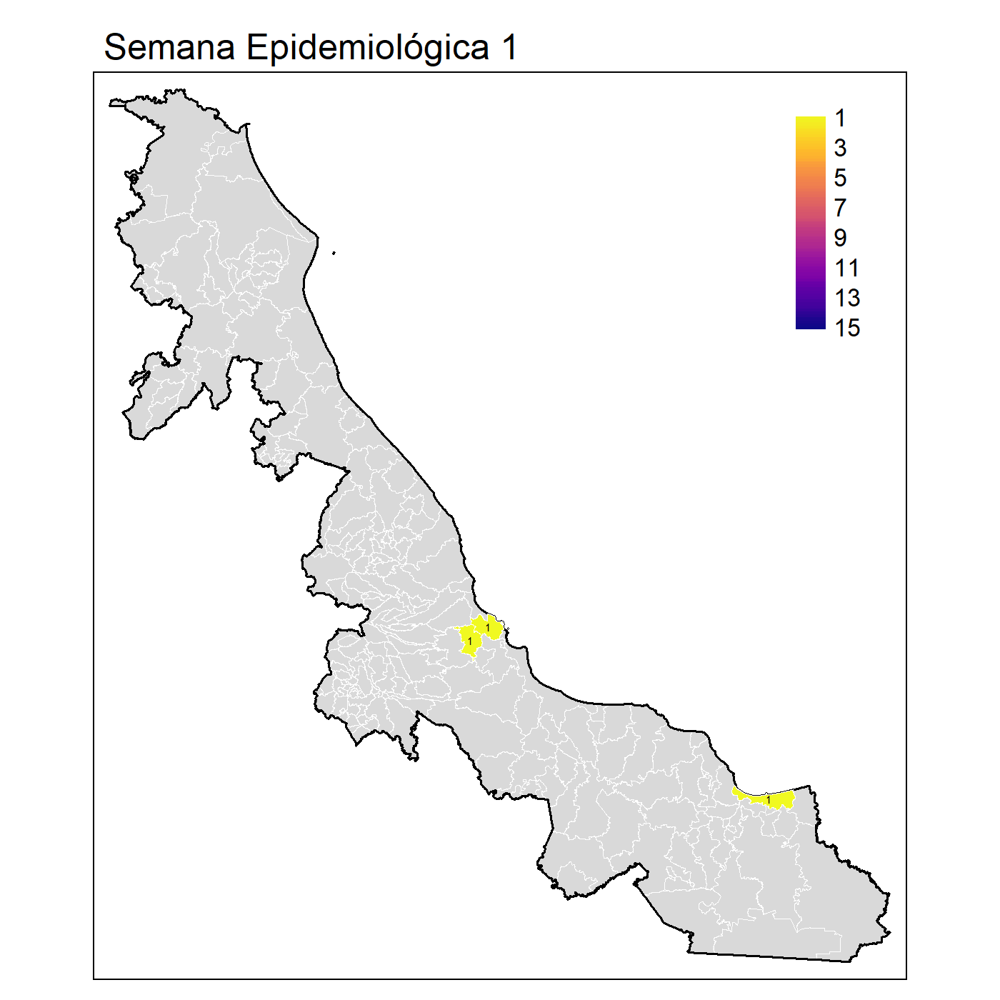
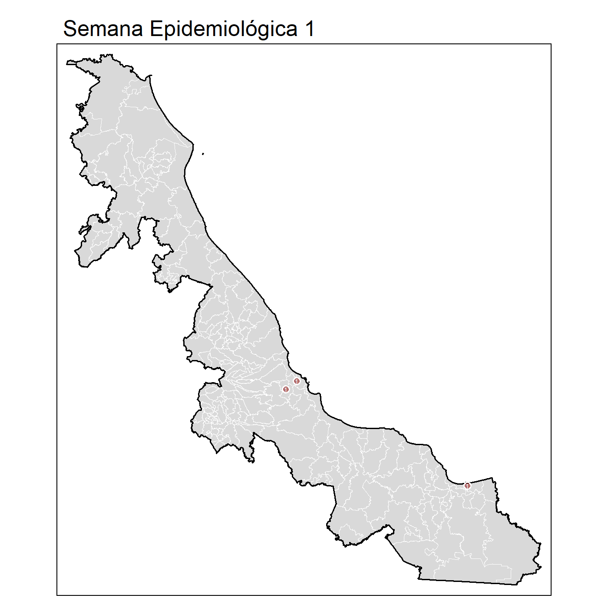

```{r, cache=TRUE}
x <- boldenr::read_dataset_bol(path = "C:/Users/felip/OneDrive/datasets/DGE/arbo/",
                                dataset = "sinave")
source('C:/Users/felip/Dropbox/r_developments/r_dashboards/github_pages/test_dashboard/3.Functions/heatmap_confirmados.R')
```

```{r}
library(formattable)
library(tmap)
library(rmarkdown)
library(knitr)
library(shiny)
library(flexdashboard)
library(plotly)
library(boldenr)
library(magrittr)
library(leaflet)
library(ggplot2)
```


**Vigilancia Epidemiológica**
=====================================  

Column {.tabset}
------------------------------------


### **<span style="color:#7d9029"> Casos por Estado </span>**
<html>
<head>
<style>
</style>
</head>
<body>
<div >
  <h2></h2>
  <p></p>

#### **<span style="color:blue">Rank de los Casos de Dengue por semana </span>**
```{r}
##
rank_cases <- function(x){
    x %>%
        arrange(dplyr::desc(value)) %>%
        dplyr::mutate(rank = 1:dplyr::n())
}
##

df <- x %>%
    dplyr::filter(ANO == 2021) %>%
    dplyr::filter(!DES_EDO_RES %in% c("OTROS PAISES", 
                                      "OTROS PAISES DE LATINOAMERICA",
                                      "ESTADOS UNIDOS DE NORTEAMERICA")) %>%
    dplyr::filter(DES_DIAG_FINAL %in% 
                      c("DENGUE CON SIGNOS DE ALARMA", 
                        "DENGUE NO GRAVE", 
                        "DENGUE GRAVE")) %>%
    dplyr::group_by(DES_EDO_RES, SEM) %>%
    dplyr::summarise(value = dplyr::n(), .groups = "drop") %>%
    dplyr::group_by(SEM) %>%
    dplyr::mutate(CVE_EDO_RES = DES_EDO_RES) %>%
    #dplyr::mutate(rank = rank(value, ties.method = "random"))%>% 
    tidyr::nest() %>%
    dplyr::mutate(rank = purrr::map(data,
                                    rank_cases)) %>%
    dplyr::select(-data) %>%
    tidyr::unnest(cols = c(rank)) %>%
    as.data.frame()


plotly::ggplotly(
    ggplot2::ggplot(data = df,
                    ggplot2:::aes(SEM, 
                                  rank, 
                                  color = CVE_EDO_RES)) +
        ggplot2::geom_point(size = 5) +
        ggplot2::geom_text(data = df %>% 
                               dplyr::filter(SEM == min(SEM)),
                           ggplot2::aes(x = SEM - .1, 
                                        label = CVE_EDO_RES), 
                           size = 3, 
                           nudge_x = -1,
                           hjust = 1) +
        ggplot2::geom_text(data = df %>% 
                               dplyr::filter(SEM == max(SEM)),
                           ggplot2::aes(x = SEM + .1, 
                                        label = CVE_EDO_RES), 
                           size = 3, 
                           nudge_x = 1,
                           hjust = 0) +
        ggbump::geom_bump(size = 2, smooth = 8) +
        ggplot2::scale_x_continuous(breaks = seq(1, max(df$SEM), 1)) +
        cowplot::theme_minimal_grid(font_size = 14, 
                                    line_size = 0) +
        ggplot2::theme(legend.position = "none",
                       panel.grid.major = element_blank()) +
        ggplot2::labs(y = "Rank de Casos Confirmados de Dengue",
                      x = "Semana Epidemiológica") +
        ggplot2::scale_y_reverse() +
        ggplot2::scale_color_manual(values = viridis::magma(n = length(unique(df$CVE_EDO_RES))))
)

```  


<div style = "display: grid; width: 1px; grid-template-columns: 700px 700px; align-items: start; justify-content: space-between;">
#### **<span style="color:blue"> Treemap de casos acumulados </span>**
```{r, out.width="100%", out.height="100%"}
x %>%
    dplyr::filter(ANO == "2021") %>%
    dplyr::filter(!DES_EDO_RES %in% c("OTROS PAISES", 
                                      "OTROS PAISES DE LATINOAMERICA",
                                      "ESTADOS UNIDOS DE NORTEAMERICA")) %>%
    dplyr::filter(DES_DIAG_FINAL %in% 
                      c("DENGUE CON SIGNOS DE ALARMA", "DENGUE NO GRAVE", 
                        "DENGUE GRAVE")) %>%
    dplyr::group_by(DES_EDO_RES,DES_DIAG_FINAL) %>%
    dplyr::summarise(value = dplyr::n(), 
                     .groups = "drop") %>%
    dplyr::mutate(DES_EDO_RES = stringr::str_to_title(DES_EDO_RES),
                  DES_DIAG_FINAL = stringr::str_to_title(DES_DIAG_FINAL)) %>%
    dplyr::mutate(DES_DIAG_FINAL = factor(DES_DIAG_FINAL,
                                          levels = c("Dengue Con Signos De Alarma",
                                                     "Dengue Grave",
                                                     "Dengue No Grave"),
                                          labels = c("DSA", "DG", "DNG"))) %>%
    ggplot2::ggplot(ggplot2::aes(area = value, 
                                 fill = DES_EDO_RES,
                                 subgroup = DES_EDO_RES,
                                 label = DES_DIAG_FINAL)) +
    treemapify::geom_treemap() +
    treemapify::geom_treemap_text(fontface = "italic", 
                                  colour = "black", 
                                  place = "bottom",
                                  #alpha = 0.5,
                                  grow = F) +
    treemapify::geom_treemap_subgroup_text(place = "middle", 
                                           colour = "White", 
                                           #alpha = 0.8, 
                                           grow = T)+
    ggplot2::theme(legend.position = "none") +
    ggplot2::scale_fill_viridis_d()
```

<div>
#### **<span style="color:blue"> Casos confirmados y serotipos </span>**
```{r,out.width="100%", out.height="100%"}
boldenr::plot_state_serotype(dataset = x, 
                                  year = 2021, 
                                  x_serotype  = 0.5, 
                                  y_serotype = 0.17, 
                                  scale_serotype = 1.7)
```
</div>
</div>


#### **<span style="color:blue"> Heatmap de casos confirmados por semana </span>**
```{r}
heatmap_confirmados(dataset = x, 
                    year = 2021, 
                    size_text = 3, 
                    EDO = TRUE)
```


<div style = "display: grid; width: 1px; grid-template-columns: 700px 700px; align-items: start; justify-content: space-between;">
#### **<span style="color:blue"> Casos por Municipio (Areal Map) </span>**

<div>
#### **<span style="color:blue"> Casos por  Municipio (Dot Map)  </span>**

</div>
</div>


</div>
</body>
</html>

